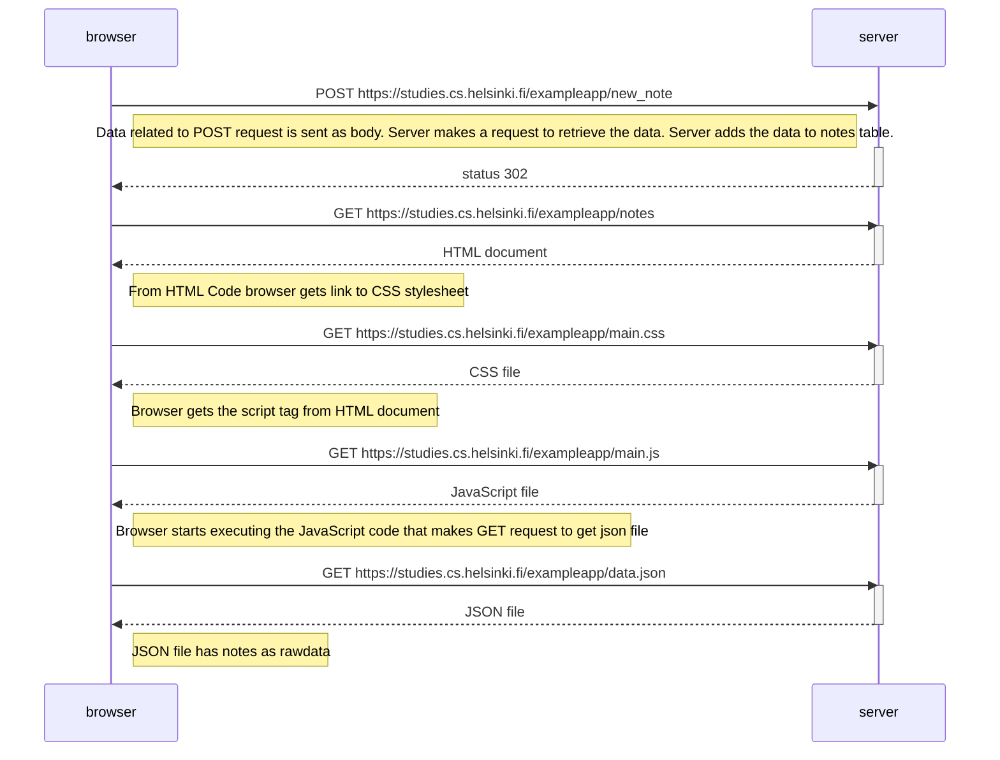

```mermaid
sequenceDiagram
  participant browser
  participant server

  browser->>server: POST https://studies.cs.helsinki.fi/exampleapp/new_note
  
  Note right of browser: Data related to POST request is sent as body. Server makes a request to retrieve the data. Server adds the data to notes table.

  activate server
  server-->>browser: status 302
  deactivate server

  browser->>server: GET https://studies.cs.helsinki.fi/exampleapp/notes
  activate server
  server-->>browser: HTML document
  deactivate server
  Note right of browser: From HTML Code browser gets link to CSS stylesheet
  
  browser->>server: GET https://studies.cs.helsinki.fi/exampleapp/main.css
  activate server
  server-->>browser: CSS file
  deactivate server
  Note right of browser: Browser gets the script tag from HTML document
  
  browser->>server: GET https://studies.cs.helsinki.fi/exampleapp/main.js
  activate server
  server-->>browser: JavaScript file
  deactivate server
  
  Note right of browser: Browser starts executing the JavaScript code that makes GET request to get json file
  
  browser->>server: GET https://studies.cs.helsinki.fi/exampleapp/data.json
  activate server
  server-->>browser: JSON file
  deactivate server
  Note right of browser: JSON file has notes as rawdata
```
