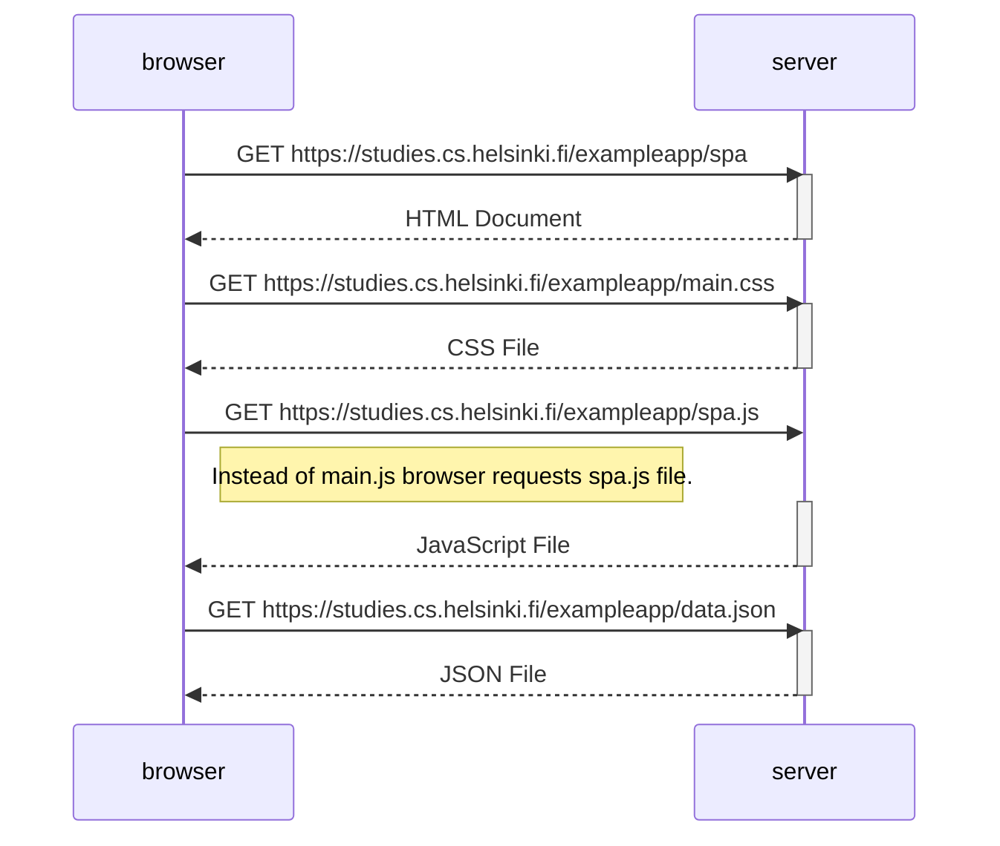

```mermaid
sequenceDiagram
  participant browser
  participant server

  browser->>server: GET https://studies.cs.helsinki.fi/exampleapp/spa
  activate server
  server-->>browser: HTML Document
  deactivate server

  browser->>server: GET https://studies.cs.helsinki.fi/exampleapp/main.css
  activate server
  server-->>browser: CSS File
  deactivate server

  browser->>server: GET https://studies.cs.helsinki.fi/exampleapp/spa.js
  Note right of browser: Instead of main.js browser requests spa.js file.
  activate server
  server-->>browser: JavaScript File
  deactivate server

  browser->>server: GET https://studies.cs.helsinki.fi/exampleapp/data.json
  activate server
  server-->>browser: JSON File
  deactivate server
```
